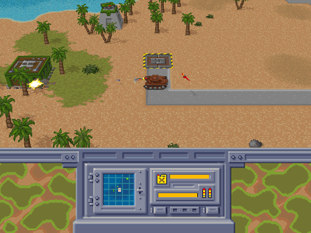

# OpenRF — Return Fire, native again

**Docs, user guide and screenshots: [openrf.emdzej.pl](https://openrf.emdzej.pl)** ·
[Download](https://github.com/emdzej/openrf/releases) ·
[Play in the browser](https://openrf.emdzej.pl/play/)

[](https://gasm.emdzej.pl)



A from-scratch, portable reimplementation of **Return Fire** (Silent Software, Windows 95
edition, 1996) in C11. It runs as a native macOS app (SDL3, universal: Apple Silicon and Intel) and as
`openrf.wasm`, a module for the [gasm](https://gasm.emdzej.pl) WebAssembly game runtime (macOS, Linux,
Windows, browser); native SDL builds for Windows and Linux are planned. It contains no original code, assets or data: it reads the data files, and
the tables of the original game program (`RFIRE.BIN`: 3D models, object and sound tables), directly
from your own copy of the game CD.

## Download

From the [releases](https://github.com/emdzej/openrf/releases) (each file with a `.sha256`; none contains game
data, you need your own Return Fire CD):

| File | What |
|---|---|
| `OpenRF-<version>-macos-universal.zip` | Native macOS app (SDL3, Apple Silicon and Intel), recommended on a Mac |
| `openrf-gasm-<version>-macos-universal.zip` | `Return Fire (gasm).app`: `openrf.wasm` with the bundled `gasm-run` |
| `openrf-gasm-<version>-linux-x86_64.tar.gz`, `-linux-arm64.tar.gz` | Linux gasm bundle, `./openrf.sh` |
| `openrf-gasm-<version>-windows-x86_64.zip` | Windows gasm bundle, `OpenRF.cmd` |
| `openrf-<version>.wasm` | The module alone, for your own `gasm-run` 0.5.0+ |

The bundle launchers ask for the CD once (a folder, a mounted image, or a raw `.bin` / `.iso`) and remember
it; `--change-cd` picks another. First-run notes (Gatekeeper, SmartScreen) and details:
[Installing](https://openrf.emdzej.pl/guide/install).

## Play in the browser

[openrf.emdzej.pl/play](https://openrf.emdzej.pl/play/) runs `openrf.wasm` in your browser (Chrome, Edge,
Firefox, Safari). Choose your Return Fire CD folder (the disc, a mounted image, or a copy) once: the page
checks it and copies it into the browser's private storage for the site (OPFS), so later visits start at
once. Nothing is uploaded, and the site contains no game data. Keyboard (two players can share it) and
gamepads. Locally: `docs/scripts/copy-wasm.sh && (cd docs && pnpm build)`, then serve
`docs/.vitepress/dist` and open `/play/`.

## Build

Requirements: Xcode command line tools, CMake, SDL3 (`brew install cmake sdl3`).

```sh
cmake -S . -B build -DCMAKE_BUILD_TYPE=Release
cmake --build build -j
```

This produces `build/Return Fire.app`.

The gasm module (needs wasi-sdk and gasm's C SDK; `tools/fetch-gasm-sdk.sh` downloads both into `.deps/`):

```sh
tools/fetch-gasm-sdk.sh
cmake -S . -B build-gasm -DOPENRF_PLATFORM=gasm -DCMAKE_BUILD_TYPE=Release \
  -DCMAKE_TOOLCHAIN_FILE=.deps/gasm-c-sdk/cmake/gasm-toolchain.cmake -DWASI_SDK_PREFIX="$PWD/.deps/wasi-sdk"
cmake --build build-gasm -j      # -> build-gasm/openrf.wasm
gasm-run build-gasm/openrf.wasm --asset-dir /Volumes/RFIRE     # the CD, a mounted image, or ./cd
gasm-run build-gasm/openrf.wasm --asset "cd=Return Fire (Europe) (En,Fr,De,Es,It).bin"   # or an image
```

The module needs gasm 0.5.0 or newer (it reads the raw keyboard, with the original key bindings).

Options become launch params there (`--param skip_intro=1`, `play`, `play2`, `level`, `demo`, `p1`, `p2`):
see [docs/guide/gasm.md](docs/guide/gasm.md).

## Game data

OpenRF reads the CD directly from a **disc image** (`.cue` + `.bin` raw MODE1/2352, or `.iso`) or from an
extracted folder containing `ART/`, `SOUND/`, `TITLE/`, `WORLDS/` and `RFIRE.BIN` (the original game program,
on the root of the CD; OpenRF checks it is the supported build). Pass either as the first argument:

```sh
"build/Return Fire.app/Contents/MacOS/Return Fire" "Return Fire (Europe) (En,Fr,De,Es,It).cue"
"build/Return Fire.app/Contents/MacOS/Return Fire" cd
```

or put it in the bundle as `Return Fire.app/Contents/Resources/data` (a folder) or `data.cue`/`data.bin`/`data.iso`,
or next to the bundle as `cd` (folder or `cd.cue`/`cd.bin`/`cd.iso`). If `./cd` exists at build time, the build
links it into the bundle as `Contents/Resources/data`. The tests and tools read `./cd` (see
`docs/howto/extract-cd.md`), or `OPENRF_DATA=<folder or image>`.

Options: `--skip-intro`, `--play` (straight into the `--level` map, level 1 by default), `--play2` (straight into
a 2-player game: "Driving School" or the `--level` 2-player map), `--level <n | path>` (n = 1..100 one-player
maps, 101..204 two-player maps, or a path such as `WORLDS/2PLAYER/LEVEL3/RFMAP115.RFM`; the player count comes
from the map), `--viewer` (map viewer).
Title screen: `1`–`9` start the first map of a difficulty level, `Shift`+`1`–`9` the same for two players,
`F2` the current map, `F3` the current two-player map. After a 2-player game the scores (wins per side, draws)
are kept per pair of names: `OPENRF_P1` / `OPENRF_P2` (default `$USER` / "Player 2").
Debug: `OPENRF_DEMO=1` scripts input (launch a tank and drive); `OPENRF_CAM_H=<n>` sets the driving
camera height (0 = 1.0x zoom; the value recovered from the binary is -170 = 2.3x, unverified).
Debug: `OPENRF_SHOT=out.bmp OPENRF_SHOT_MS=2000` saves one frame and exits. `OPENRF_FIXED_STEP=1` runs on a virtual 16 ms/frame clock
(reproducible frames, for before/after `cmp`).
Debug (2-player maps): `OPENRF_DEMO=2p` (player 1 launches a tank, player 2 a jeep, both drive), `2pheli`
(player 2 takes the heli), `2pwin` (player 2 wins: green banner), `2pspectate` (player 1 loses everything:
fly-back skull, then the spectate screen).

## Controls (original defaults)

| | Player 1 | Player 2 |
|---|---|---|
| Move | W A S D (or arrows) | Num 8 4 5 6 |
| Buttons 1–3 | H J K | Num − + Enter |
| Buttons 4–5 | Q E | Num 7 9 |

In the bunker: W/S/A/D choose a vehicle, H launches (player 2: Num 8/5/4/6, Num −). Driving back onto the pad
and pressing H docks. In a 2-player game the screen is split (player 1 left, blue; player 2 right, green) and
Alt+3 swaps the two keyboard layouts between the players (Swap Sides). A player left with no vehicles while the
other still has jeeps watches the skull screen until the game ends; with no jeeps on either side it is a draw.
Esc leaves the level. Alt+Enter toggles fullscreen, M mutes the game. Map viewer: arrows scroll, `[` `]` change map, Esc returns.
Gamepads work too (first pad player 1, second player 2): d-pad/stick, A/B/X = H/J/K, L/R = Q/E, START = F2 on the
title / launch in the bunker, SELECT = swap sides, START+SELECT = Esc (see `docs/guide/controls.md`).

## Status

| Area | State |
|---|---|
| Intro stills + STM movies (own Cinepak decoder) | done |
| Disc images (ISO 9660 in .iso / raw .bin / .cue), gamepads | done |
| gasm backend (`openrf.wasm`, deterministic, pixel-identical to the fixed-step app) | done |
| Title screen, music director (SCORE.WAV track table) | done |
| ART.CAR sprites, TRANS.TBL, RFM maps | done |
| Perspective world renderer, 3D models (pixel-identical to tools/view.py) | done |
| Object system, bunker/lift, vehicle movement, collision, water | done (1P and 2P) |
| Vehicle models (turret, tracks, rotor, shadows, wrecks, lift) | done |
| Bunker vehicle-select screen, dashboard HUD, radar, fuel/ammo gauges | done |
| Weapons, explosions, damage, sound effects | done |
| Turrets, drone, submarine, soldiers, gates, flag, mines, win/loss, high scores | done |
| 2-player split screen (views, status bar, HUDs, two listeners, spectate, draw, 2P scores) | done |

## Layout

- `src/` — engine (C11): a portable core (frame-driven app state machine, file layer, audio mixer, game) and two
  backends for the contract in `src/platform.h`: `platform_sdl.c` (SDL3, the only file that uses SDL) and
  `platform_gasm.c` (gasm). Original function
  addresses are cited in comments.
- `tools/` — Python decoders/reference renderers for each format.
- `docs/` — reverse-engineering notes: `car.md`, `rfm.md`, `stm.md`, `architecture.md`, …
- `re/` — Ghidra scripts and decompiler dumps (local reference only).

## License

OpenRF is free software under the [GNU GPL v3](LICENSE). Return Fire is © 1995–1996
Silent Software / Prolific Publishing; OpenRF contains none of its code or assets —
you need your own copy of the game.
